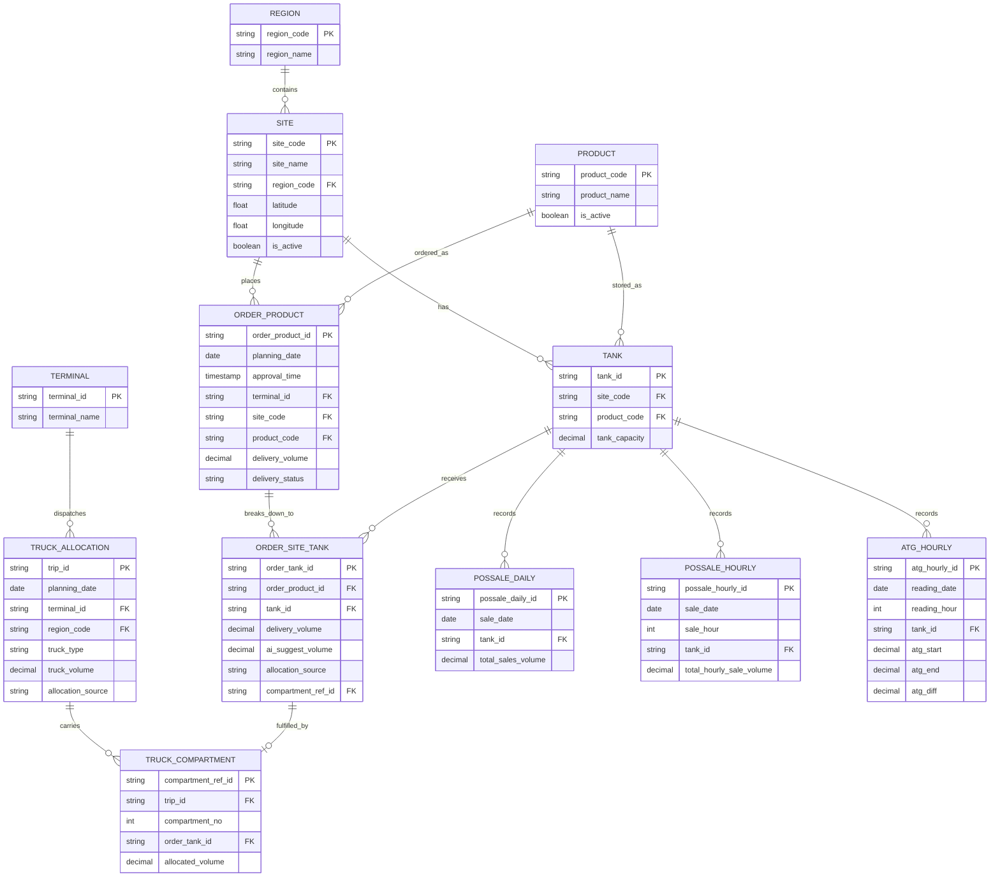

# GAIA → AI Data Platform Integration Spec

Covers: storage/transform architecture (Iceberg + dbt + Trino), the REST API GAIA exposes for extraction, JSON payload structures, recommended field adjustments, and the entity-relationship model — built from the GAIA data checklist (Items 0–6) and the COCO Lakehouse architecture slides.

---

## 1. Architecture

**Orchestration → storage → transform → serving**

```
GAIA (REST API)
   │  Airflow: midnight EOD schedule + master-data change trigger
   ▼
Bronze  (Iceberg table on MinIO)  — raw, append-only, as received
   │  dbt: stg_* models (rename, type-cast, dedupe)
   ▼
Silver  (Iceberg table on MinIO)  — validated, SCD2 for master data
   │  dbt: int_* / mart_* models (feature engineering, joins)
   ▼
Gold    (Iceberg table on MinIO)  — ML-ready feature tables
   │  Trino (unified SQL catalog)
   ├──► Superset       (fraud + ops dashboards)
   ├──► Power BI       (business reporting)
   └──► ML training pipeline (feature consumption)
```

### Why Iceberg over plain Parquet-on-MinIO
- **ACID + MERGE INTO**: master-data upserts (Item 0) and SCD2 versioning in Silver need atomic writes — raw Parquet directories don't give you that safely under concurrent Airflow/dbt runs.
- **Schema evolution**: GAIA's field list will grow (the slides already flag "field อื่นตามมาทีหลัง" — more fields added later). Iceberg handles additive/renamed columns without rewriting historical partitions.
- **Time travel**: lets you reproduce a training snapshot exactly as it looked on a given date — important for the AI Decision Guard / Volume Suggestion models that backtest against historical allocations.
- **Partition evolution**: start partitioned by `sale_date`, change strategy later without a full rewrite.

**Catalog**: use an Iceberg REST catalog (or Hive Metastore if already standard in your stack) so Airflow, dbt, and Trino all resolve the same table metadata consistently.

### dbt layer
```
models/
  staging/       stg_gaia__sites.sql, stg_gaia__order_product.sql, stg_gaia__order_site_tank.sql, ...
                 (1:1 with Bronze sources, light renaming/casting only)
  intermediate/  int_order_site_tank_enriched.sql, int_tank_daily_features.sql
                 (joins, the Flag Condition anomaly rules from the checklist)
  marts/
    silver/      site-tank order history with SCD2 master-data joins
    gold/        feature tables matching the Decision Model / Volume Model feature lists
                 (overdue_ratio, inv_days_cover, dow_hist_rate, hist_rate, pair_deliv_mean, yoy_deliv, ...)
```
Run dbt on a Trino or Spark adapter against the same Iceberg catalog Airflow writes to — one engine, one source of truth, no separate copy for BI vs ML.

### Trino as the serving adaptor
- One Iceberg catalog registered in Trino, exposed to:
  - **Superset**: native Trino connector (SQLAlchemy `trino://`), row-level access control can be layered per team.
  - **Power BI**: Trino JDBC/ODBC (Simba Trino driver), DirectQuery against Gold marts for near-real-time dashboards without exporting data out of the lakehouse.
  - **ML training**: same SQL surface, so features used in training match features visible in BI — no drift between "what the dashboard shows" and "what the model trained on."

---

## 2. REST API design

Two ingestion patterns, matching the checklist's own update cadence:

| Pull type | Trigger | Checklist items |
|---|---|---|
| **Master data** | Airflow sensor/webhook on change | Item 0 (site/region/terminal) |
| **Transactional (EOD)** | Airflow `@daily` at 00:00, or "after planner confirms all sites" per GAIA's own cadence | Items 1–6 |

### Common conventions
- Base path: `/api/v1/`
- Auth: OAuth2 client-credentials or API key in `Authorization: Bearer <token>` — issued per consuming system (Airflow service account), not shared.
- All timestamps: ISO 8601 with explicit offset, `Asia/Bangkok` (`+07:00`).
- All volumes in **liters**, `decimal(12,2)`.
- Pagination: cursor-based, not offset (offset breaks under concurrent writes).
- Every list endpoint wraps records in a common envelope:

```json
{
  "meta": {
    "request_id": "b7e2b1f0-6e3d-4a1a-9c2e-7e4f1a2b3c4d",
    "generated_at": "2026-07-21T00:05:12+07:00",
    "page_size": 500,
    "next_cursor": "eyJvZmZzZXQiOjUwMH0=",
    "has_more": true
  },
  "data": [ ]
}
```

### Endpoints

#### `GET /api/v1/master/sites`
Item 0. Supports `?since=<ISO8601>` for incremental/change-triggered pulls — returns only records changed after that timestamp, with a `change_type` so Silver can apply SCD2 correctly.

```json
{
  "site_code": "I111",
  "site_name": "Bangkok North 12",
  "region_code": "NORTH",
  "region_name": "North",
  "terminal_id": "H104",
  "latitude": 13.7563,
  "longitude": 100.5018,
  "is_active": true,
  "change_type": "update",
  "effective_at": "2026-07-20T09:14:00+07:00",
  "source_last_update": "2026-07-20T09:14:00+07:00"
}
```

#### `GET /api/v1/orders/product?date=2026-07-20`
Item 1 (site-product level daily order).

```json
{
  "order_product_id": "OP-20260720-I111-5000018",
  "planning_date": "2026-07-20",
  "approval_time": "2026-07-20T06:32:11+07:00",
  "terminal_id": "H104",
  "site_code": "I111",
  "product_code": "5000018",
  "product_name": "HSD",
  "trip_ids": [1, 2],
  "total_tank": 2,
  "total_capacity": 40000.00,
  "open_inventory": 8500.00,
  "current_inventory_at_approval": 8200.00,
  "usage_day_at_approval": 3.4,
  "intransit_volume_at_approval": 12000.00,
  "average_sale_at_approval": 2400.00,
  "delivery_volume": 20000.00,
  "delivery_status": "good_received",
  "po_number": "PO-88213",
  "do_number": "DO-44120",
  "shipment_number": "SH-91002"
}
```

#### `GET /api/v1/orders/site-tank?date=2026-07-20`
Item 2 (site-tank breakdown; carries the AI suggestion fields).

```json
{
  "order_tank_id": "OT-20260720-I111-T01",
  "order_product_id": "OP-20260720-I111-5000018",
  "site_code": "I111",
  "tank_id": "T01",
  "tank_capacity": 20000.00,
  "product_code": "5000018",
  "delivery_volume": 10000.00,
  "delivery_status": "good_received",
  "atg_recv_time": "2026-07-20T14:02:00+07:00",
  "po_number": "PO-88213",
  "do_number": "DO-44120",
  "shipment_number": "SH-91002",
  "ai_suggest_volume": 9800.00,
  "ai_calculation_ref_id": "AI-CALC-20260720-0012",
  "allocation_source": "ai_unmodified",
  "compartment_ref_id": "TC-20260720-0007-3"
}
```
`allocation_source` enum: `ai_unmodified | ai_adjusted | manual_new` — replaces the three separate boolean flags (`AIFlag`, `AdjustFlag`, `New Create Flag`) from the original checklist; see field adjustments below.

#### `GET /api/v1/truck-allocations?date=2026-07-20`
Item 3 — compartments returned as a nested array, not eight flat columns.

```json
{
  "trip_id": "TRIP-20260720-0007",
  "planning_date": "2026-07-20",
  "approval_time": "2026-07-20T06:40:00+07:00",
  "terminal_id": "H104",
  "region_code": "NORTH",
  "truck_type": "20k",
  "site_count": 3,
  "truck_volume": 20000.00,
  "allocation_source": "ai_unmodified",
  "compartments": [
    { "compartment_ref_id": "TC-20260720-0007-1", "compartment_no": 1, "order_tank_id": "OT-20260720-I111-T01", "allocated_volume": 5000.00 },
    { "compartment_ref_id": "TC-20260720-0007-2", "compartment_no": 2, "order_tank_id": "OT-20260720-I120-T02", "allocated_volume": 7000.00 }
  ]
}
```

#### `GET /api/v1/possale/daily?date=2026-07-20`
Item 4.
```json
{ "sale_date": "2026-07-20", "site_code": "I111", "tank_id": "T01", "product_code": "5000018", "total_sales_volume": 3200.00 }
```

#### `GET /api/v1/possale/hourly?date=2026-07-20&hour=14`
Item 5.
```json
{ "sale_date": "2026-07-20", "sale_hour": 14, "site_code": "I111", "tank_id": "T01", "product_code": "5000018", "total_hourly_sale_volume": 210.00 }
```

#### `GET /api/v1/atg/hourly?date=2026-07-20&hour=14`
Item 6.
```json
{ "reading_date": "2026-07-20", "reading_hour": 14, "site_code": "I111", "tank_id": "T01", "atg_start": 8600.00, "atg_end": 8390.00, "atg_diff": 210.00 }
```

---

## 3. Suggested field adjustments

| Original (checklist) | Suggested field | Type | Why |
|---|---|---|---|
| `Terminal` | split into `terminal_id` + `terminal_name` | string | one column mixed code and name |
| `Product Code` / `Product_code` | `product_code` everywhere | string | inconsistent casing across items 1–6 |
| `Lat , Long Location` | `latitude`, `longitude` | float | combined field isn't queryable/indexable |
| `Flag` (site decommission) | `is_active` (+ `decommission_date`) | boolean/date | free-text flag → explicit boolean |
| `AIFlag`, `Adjust Flag`, `New Create Flag` | single `allocation_source` enum | string | three flags that are actually mutually exclusive states of one dimension |
| `Manual_Flag` (truck allocation) | fold into the same `allocation_source` enum at trip level | string | same anti-pattern as above |
| `Compartment Allocation 1–8` | `compartments[]` nested array | array | wide columns break when compartment count changes and don't normalize |
| `Approval Time`, `ATG Recv Time`, `Last Update` | ISO 8601 with `+07:00` offset | timestamp | slides show local time strings without explicit timezone |
| `Trip ID` ("เอามาทุก trip เลยไม่ใช้ก็ว่างไว้") | `trip_ids: []` on order-product, single `trip_id` PK on truck_allocation | array / string | one order can map to multiple trips; don't overload one field for both |
| `TruckCompartment_site_tank_reference_id` | `compartment_ref_id` | string | shorten; make it the actual FK name used consistently on both sides |
| Volume fields (no unit stated) | explicit `decimal(12,2)`, liters, documented in API contract | decimal | avoid unit ambiguity between systems |
| `Region` (name only, used as multidrop group) | add `region_code` alongside `region_name` | string | joins should key off a stable code, not a display name |

---

## 4. Entity-relationship model



Rendered versions of this architecture and ER diagram were also shown inline in chat.
